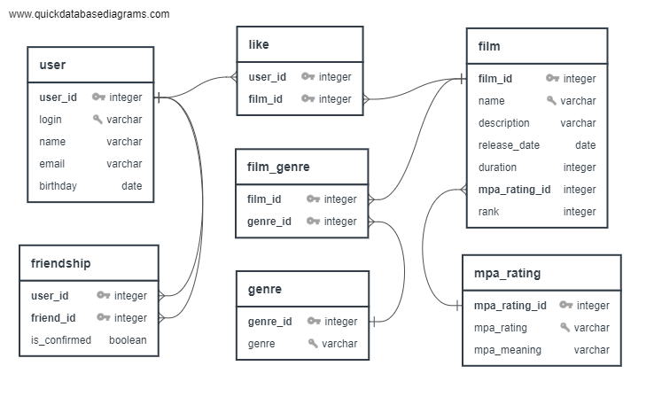

# java-filmorate

Template repository for Filmorate project.



### User SQL sample code

```
-- insert new user
INSERT INTO _user (login, name, email, birthday)
VALUES (:login, :name, :email, :birthday)",
```

```
-- update user
UPDATE _user u
SET u.login = :login,
    u.name = :name,
    u.email = :email,
    u.birthday = :birthday
WHERE u.user_id = :user_id
```

```
-- insert friendship
INSERT INTO friendship (user_id, friend_id, is_confirmed)
VALUES (:user_id, :friend_id, :is_confirmed)
```

```
-- select user
SELECT *
FROM _user u
WHERE u.user_id = :user_id
```

### Film SQL sample code

```
-- insert new film
INSERT INTO film (name, description, release_date, duration, mpa_rating_id, rank)
VALUES (:name, :description, :release_date, :duration, :mpa_rating_id, :rank)
```

```
-- update film
UPDATE film f
SET f.name = :name
    f.description = :description
    f.release_date = :release_date
    f.duration = :duration
    f.mpa_rating_id = :mpa_rating_id
    f.rank = :rank
WHERE f.film_id = :film_id
```

```
-- insert like
INSERT INTO _like (user_id, film_id)
VALUES (:user_id, :film_id)
```

```
-- select film
SELECT  f.film_id
        f.name
        f.description
        f.release_date
        f.duration
        mr.mpa_rating_id
        mr.mpa_rating
        f.rank 
FROM film f 
LEFT JOIN mpa_rating mr ON mr.mpa_rating_id = f.mpa_rating_id
WHERE f.film_id = :film_id
```